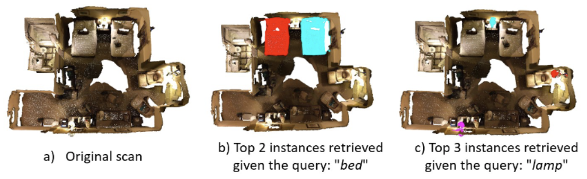
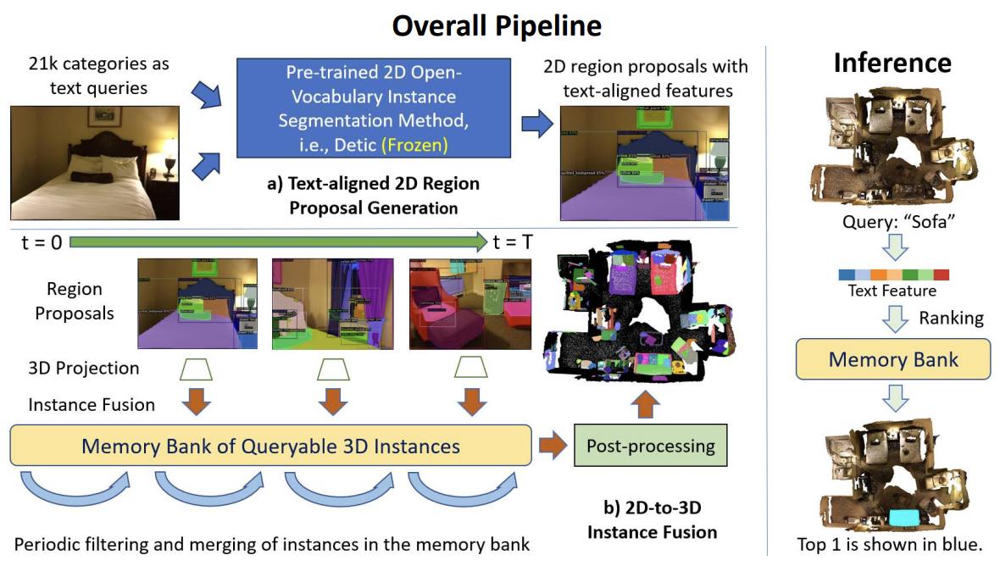

# OVIR-3D

**OVIR-3D: Open-Vocabulary 3D Instance Retrieval Without Training on 3D Data**.\
Shiyang Lu, Haonan Chang, Eric Jing, Yu Wu, Abdeslam Boularias, Kostas Bekris

To appear at [CoRL'23](https://www.corl2023.org/). Also to be presented as an extended abstract at [OpenSUN3D (ICCV-W)](https://opensun3d.github.io/).\
[[Full Paper (8-page)](https://openreview.net/pdf?id=gVBvtRqU1_)][[CoRL Poster]()]\
[[Extended Abstract (4-page)](https://github.com/shiyoung77/OVIR-3D/blob/main/ovir3d-iccvw.pdf)][[ICCV-W Poster]()]

# Intro
Recent progress on open-vocabulary (language-driven, without a predefined set of categories) 3D segmentation addresses the problem mainly at the semantic level (by mid-2023). Nevertheless, robotic applications, such as manipulation and navigation, often require 3D object geometries at the instance level. This work provides a straightforward yet effective solution for open-vocabulary 3D instance retrieval, which returns a ranked set of 3D instance segments given a 3D point cloud reconstructed from an RGB-D video and a language query.

# Key Takeaways
Directly training an open-vocabulary 3D segmentation model is hard due to the lack of annotated 3D data with enough category
varieties. Instead, this work views this problem as a 3D fusion problem from language-guided 2D region proposals, which could be trained with extensive 2D datasets, and provides a method to project and fused 2D instance information in the 3D space for fast retrieval.

# Pipeline Structure

# Code
Cleanning now. Coming soon (Expected Oct. 2023)
